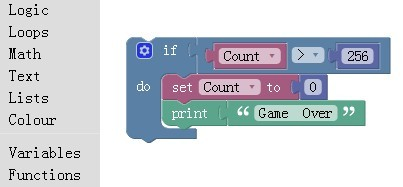

##  实验1  编程初探——Blockly Games

###  实验目的

1. 掌握使用Blockly积木块搭建程序的方法；
2. 掌握简单的循环和条件语句；
3. 学会正确选用和拼接积木块实现走迷宫程序。

### 实验原理
1. Blockly简介

Blockly是一种可视化编程语言，由Google公司开发。它的编辑界面如下图所示，将不同种类的程序积木块拼接在一起，即可完成相应的程序功能。

2. 循环语句

3. 条件语句

### 实验材料

* https://blockly-games.appspot.com/?lang=zh-hans
* blockly-games-zh-hans.zip

### 实验内容

1. 积木块的拼接

2. 走迷宫

