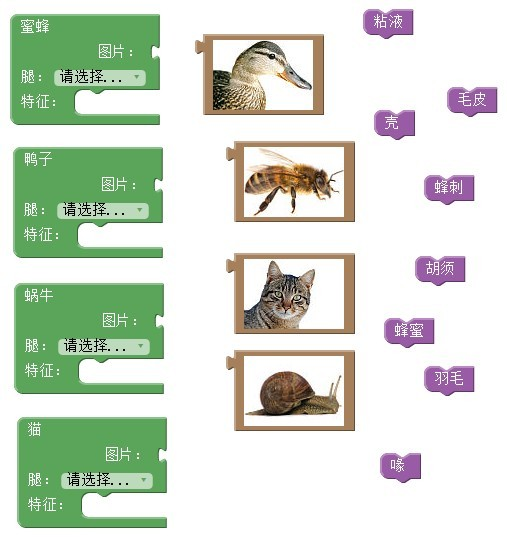

##  实验1  编程初探——Blockly Games

###  实验目的

1. 掌握使用Blockly积木块搭建程序的方法；
2. 掌握简单的循环和分支语句；
3. 学会正确选用和搭接积木块实现走迷宫程序。

### 实验原理

1. Blockly简介
 

Blockly是一种可视化编程语言，由Google公司开发。它的编辑界面如下图所示，将不同种类的程序积木块拼接在一起，即可完成相应的程序功能。

2. 简单的循环和分支语句

循环语句：本次实验涉及的循环语句是先判断是否达到条件，再决定是否执行嵌入块的程序，直到满足条件。

   
分支语句：本次实验涉及到两种条件语句。第一种是判断是否满足条件，如果满足则执行嵌入块的程序。

另一种先进行判断，按照判断的结果，分两种情况，满足条件则执行第一个区块内嵌入的程序，不满足则执行第二个区块内嵌入的程序。

### 实验材料

* https://blockly-games.appspot.com/?lang=zh-hans

### 实验内容

1. 积木块的拼接

完成拼图游戏，将动物图片和特征嵌入到相应位置，并设置腿的数目。

2. 走迷宫

完成迷宫游戏1-10关，在第10关求出尽可能多的解法。

